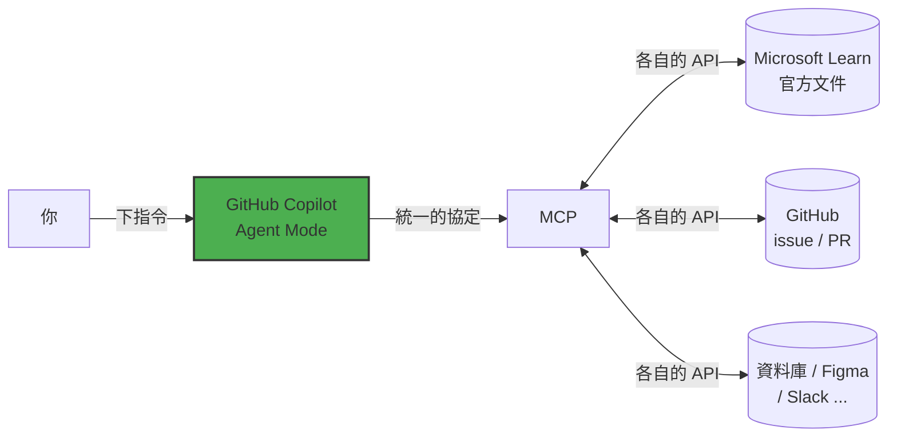

## Step 3:MCP Integration — 讓 AI 走出你的電腦

到目前為止,Copilot 只能看到**你這台電腦上的檔案**。它不知道 Microsoft 官方文件今天更新了什麼,也不知道你的 GitHub repo 上有哪些 issue。

這一關,我們用 **MCP** 幫它接上外面的世界。

> ⏱️ 預估時間:30 分鐘 &nbsp;&nbsp;|&nbsp;&nbsp; 🔋 預估 agent 回合:2 – 3 次

---

### 📖 觀念:MCP 是什麼?

**MCP(Model Context Protocol)常被形容成「AI 的 USB-C」** —— 一個通用接頭。

以前每個 AI 工具要接每個服務,都得各自寫一套整合。有了 MCP,只要服務方提供一個 **MCP Server**,任何支援 MCP 的 AI 工具都能立刻用它。



三個你需要知道的名詞:

| 名詞 | 白話 |
| :--- | :--- |
| **MCP Server** | 提供能力的一方(例如 GitHub 官方提供的伺服器,讓 AI 能讀 issue、開 PR) |
| **MCP Client** | 使用能力的一方(這裡就是 VS Code 裡的 Copilot) |
| **Tools** | Server 提供的一個個具體功能(例如 `list_issues`、`create_pull_request`) |

**Agent Mode + MCP 是怎麼運作的?**

你每送出一則提示詞,Copilot 會把「目前可用的工具清單」一起帶給模型。模型自己判斷:這件事需不需要用工具?用哪一個?要帶什麼參數?然後執行、拿到結果、再繼續往下做。

> 🔐 **安全提醒(請認真看)**
> MCP Server 會在你的電腦上執行程式碼、或代表你去存取遠端服務。
> - **只安裝你信任來源的 MCP Server**(官方出品、或你看過原始碼的)
> - 第一次呼叫某個工具時,VS Code 會跳出**授權對話框** —— 請**看清楚它要做什麼**再按 Continue
> - 涉及寫入的操作(建立 issue、開 PR、刪除檔案)尤其要看

---

### ⌨️ 動手做 A:接上 Microsoft Learn MCP(免登入,30 秒完成)

我們先接一個最無痛的:Microsoft 官方文件的 MCP Server。它**不需要 API 金鑰、不需要登入、完全免費**。

#### 1. 建立設定檔

在專案根目錄建立資料夾 `.vscode`,並在裡面建立檔案 `mcp.json`。

> 💡 **偷懶做法**:直接叫 agent 幫你建 —— 用 AI 來設定 AI:
> ```prompt
> 請在專案根目錄建立 .vscode/mcp.json,內容如下(原封不動,不要改動任何欄位):
> { "servers": { "microsoft-learn": { "type": "http", "url": "https://learn.microsoft.com/api/mcp" } } }
> ```

📄 **`.vscode/mcp.json`**

```json
{
  "servers": {
    "microsoft-learn": {
      "type": "http",
      "url": "https://learn.microsoft.com/api/mcp"
    }
  }
}
```

#### 2. 啟動它

存檔後,VS Code 會在 `"microsoft-learn"` 那一行**正上方**出現一排小小的灰字:**Start | 更多…**

點 **Start**。成功的話那排字會變成 **Running | Stop | Restart** 之類的狀態。

<!-- 📸 TODO 截圖:mcp-start-codelens.png — mcp.json 上方的 Start CodeLens -->

> 🤷 **沒看到 Start?** 試試:命令面板(<kbd>Ctrl</kbd>+<kbd>Shift</kbd>+<kbd>P</kbd>)→ 輸入 `MCP: List Servers` → 選 `microsoft-learn` → **Start Server**。

#### 3. 確認工具已載入

回到 Chat 面板(確認還在 **Agent** 模式),點輸入框旁的**工具圖示 🛠️**,你應該會在清單裡看到 `microsoft-learn` 以及它底下的幾個工具(例如文件搜尋、擷取文章)。確認它們是**勾選**狀態。

#### 4. 讓 agent 真的去查文件

> 
>
> ```prompt
> 請使用 Microsoft Learn 的文件工具,查詢關於 CSS prefers-color-scheme 以及網頁深色模式無障礙(色彩對比)的官方建議。
> 先把查到的重點用繁體中文條列給我,並附上你參考的文件連結。
> 然後檢查我們專案的 styles.css,告訴我目前的深色配色有沒有需要改進的地方(先不要動手改,只要告訴我)。
> ```

<details>
<summary>🇬🇧 English version(點開)</summary>

```prompt
Use the Microsoft Learn documentation tools to look up official guidance on CSS prefers-color-scheme
and dark-mode accessibility (color contrast).
First summarize the key points as a bullet list and include the documentation links you used.
Then review styles.css in this project and tell me whether the current dark palette needs improvement.
Do not change any files yet — just report back.
```

</details>

**觀察重點** 👀:
- Chat 裡會出現一個**工具呼叫的區塊**,顯示它正在查詢文件(可以點開看它送了什麼查詢字串)
- 第一次可能跳出授權對話框 → 看一眼 → **Continue**
- 回覆裡應該會有 **learn.microsoft.com 的實際連結**

> ✨ **這就是 MCP 的價值**:模型的訓練資料有時效性,但透過 MCP 它可以**現場去查最新的官方文件**。

---

### ⌨️ 動手做 B:接上 GitHub MCP(連你自己的帳號)

現在來接一個更有感的 —— 讓 AI 能讀寫**你自己 GitHub repo** 的內容。

#### 1. 加上第二個 server

把 `.vscode/mcp.json` 改成:

📄 **`.vscode/mcp.json`**

```json
{
  "servers": {
    "microsoft-learn": {
      "type": "http",
      "url": "https://learn.microsoft.com/api/mcp"
    },
    "github": {
      "type": "http",
      "url": "https://api.githubcopilot.com/mcp/"
    }
  }
}
```

#### 2. 啟動並授權

在 `"github"` 那一行上方點 **Start**。這次 VS Code 會跳出 **GitHub 授權**的對話框 → 按 **Allow / 允許**,可能會開瀏覽器讓你確認一次。

<!-- 📸 TODO 截圖:mcp-github-oauth.png — VS Code 的 GitHub 授權對話框 -->

#### 3. 讓 agent 讀你的 repo

> 
>
> ```prompt
> 請使用 GitHub 的工具,列出這個 repo({{full_repo_name}})目前所有開啟中的 issue。
> 用繁體中文整理成表格,欄位包含:編號、標題、標籤、一句話摘要。
> ```

<details>
<summary>🇬🇧 English version(點開)</summary>

```prompt
Use the GitHub tools to list all open issues in this repository ({{full_repo_name}}).
Present them as a table with columns: number, title, labels, and a one-line summary.
```

</details>

你應該至少會看到本次練習的 **Exercise** issue。**AI 現在讀得到你 GitHub 上的東西了。**

---

### ✅ 完成檢查

- [ ] `.vscode/mcp.json` 已建立,裡面有 `microsoft-learn`(GitHub 是加分題)
- [ ] MCP server 顯示為 **Running**
- [ ] Chat 的工具清單裡看得到 MCP 提供的工具
- [ ] 至少成功執行過一次工具呼叫,並在回覆中看到外部來源的資訊

---

### 🔄 出問題怎麼辦?

| 狀況 | 解法 |
| :--- | :--- |
| JSON 格式錯誤(檔案出現紅色波浪底線) | `git restore .vscode/mcp.json`,或直接複製 `solutions/step-3/mcp.json` |
| Server 起不來、顯示錯誤 | 命令面板 → `MCP: List Servers` → 選該 server → **Show Output** 看錯誤訊息 |
| 公司網路 / Proxy 擋住連線 | **只留 `microsoft-learn` 也可以推關**,GitHub MCP 在 Step 4 可改用手動方式替代 |
| GitHub 授權一直失敗 | 先跳過,**不影響推關**。Step 4 會提供不用 GitHub MCP 的替代做法 |

> 🔸 **重要**:這一關只要 `.vscode/mcp.json` 存在就會通過檢查。**兩個 server 沒有全部接成功也沒關係**,先往下走。

---

### 🔋 額度不夠 / 卡住超過 5 分鐘?

```bash
mkdir -p .vscode && cp solutions/step-3/mcp.json .vscode/mcp.json
```

---

### 🚀 推進到下一關

```bash
git add .
git commit -m "step 3: 接上 Microsoft Learn 與 GitHub MCP Server"
git pull --rebase
git push
```

> 🎁 推上去之後,機器人除了貼出 Step 4,還會**在你的 repo 裡自動建立幾個 issue** —— 那是 Step 4 要交給 AI 處理的真實任務。
