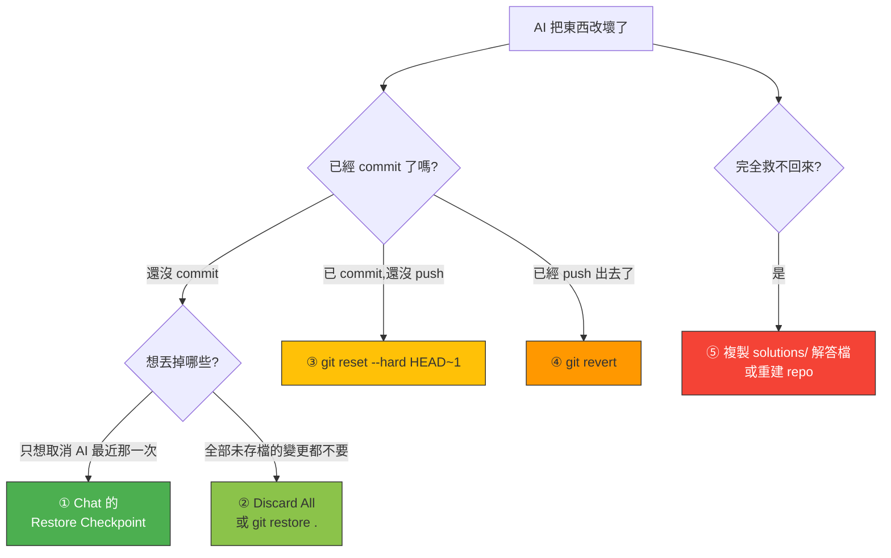

# 🔄 還原指南 — AI 把東西改壞了怎麼辦

> **先講結論:你永遠救得回來。** 這份文件從最輕鬆到最激烈,列出五層防線。

---

## 🌳 先看這棵決策樹



---

## ① Chat 的 Restore Checkpoint(最推薦)

**適用**:剛剛那一次 agent 的改動很糟,想整個取消。

VS Code 會在**每次你送出提示詞之前**自動存一份快照。

**怎麼用**:在 Chat 面板找到那次提問,滑鼠移上去 → 點 **Restore Checkpoint**(還原檢查點)。

> ✅ 那次提問**之後**的所有檔案變更會全部還原。
> ✅ 完全不需要用到 git,最無痛。
> ⚠️ 只在同一個 Chat 工作階段內有效,清空對話後就沒了。

---

## ② 丟掉所有未 commit 的變更

**適用**:改了好幾輪,已經分不清哪些是好的,直接回到上次 commit 的狀態。

### 用 VS Code(不用打指令)

左側 **原始檔控制**(Source Control,分支圖示)→ 在 **Changes** 標題列點 **↩︎ Discard All Changes**

### 用指令

```bash
git restore .
git clean -fd
```

| 指令 | 作用 |
| :--- | :--- |
| `git restore .` | 把**已追蹤**的檔案還原成上次 commit 的樣子 |
| `git clean -fd` | 刪掉那些**新建立、還沒加入 git** 的檔案和資料夾 |

> ⚠️ 這兩個指令**不可復原**。執行前先確認 `git status` 列出的東西你都不想要。

---

## ③ 已經 commit,但還沒 push

```bash
git reset --hard HEAD~1
```

丟掉**最後一次** commit,連同它的檔案變更。

想丟掉最後兩次就用 `HEAD~2`,以此類推。

> 💡 **先看清楚要丟什麼**:
> ```bash
> git log --oneline -5
> ```

---

## ④ 已經 push 出去了

**不要用 `reset` + force push。** 改用 `revert` —— 它會建立一個「做相反變更」的新 commit,歷史不會被改寫。

```bash
git log --oneline -5          # 找出要撤銷的那個 commit 的代碼
git revert <commit代碼>
git push
```

撤銷最後一次就直接:

```bash
git revert HEAD
git push
```

---

## ⑤ 核彈選項

### 5a. 直接用解答檔覆蓋

最快也最實際的做法。每一關的完整解答都在 [`solutions/`](../solutions/):

```bash
# 例如回到 Step 2 的正確狀態
cp solutions/step-2/index.html solutions/step-2/styles.css solutions/step-2/app.js .
```

完整對照表在 [solutions/README.md](../solutions/README.md)。

### 5b. 重建一個 repo

真的全毀了(例如 git 歷史整個亂掉),就回到 [template repo](https://github.com/matsurigoto/copilot-workshop-agent-mode-mcp) 重新 **Use this template** 建一個新的,關卡會從頭跑一次。

> 這是最後手段,但**兩分鐘就能重來**,不用心疼。

---

## ⚠️ 兩個一定要知道的陷阱

### 陷阱一:關卡進度不會倒退

你把**程式碼**還原了,但**練習進度不會跟著退回去**。

機器人是根據「你 push 了什麼」來推關的,已經推進的關卡會停在那裡。這**不影響你繼續往下做** —— 只要照著 issue 裡的最新一關做就好。

真的想從頭跑一次,請用 **5b 重建 repo**。

### 陷阱二:`git push` 被拒絕

```
! [rejected]  main -> main (fetch first)
```

**原因**:練習的機器人會自動 commit 東西回 `main` 分支(更新 README、貼步驟內容),你本機的版本落後了。

**解法**:

```bash
git pull --rebase
git push
```

> 💡 **所以每一關的推關指令都是這個順序**:
> ```bash
> git add .
> git commit -m "..."
> git pull --rebase      # ← 這行不能省
> git push
> ```

如果 `git pull --rebase` 出現衝突(conflict),看 [疑難排解](troubleshooting.md#rebase-衝突)。

---

## 🛡️ 最好的還原,是事先預防

**每一關開始前,先存一個檔:**

```bash
git add .
git commit -m "checkpoint: step N 開始前"
```

有了這個點,無論等一下發生什麼事,你都回得去。**這是專業開發者跟 AI 協作的基本習慣。**

---

## 📋 指令速查

| 我想… | 指令 |
| :--- | :--- |
| 看現在有哪些變更 | `git status` |
| 看最近幾次 commit | `git log --oneline -5` |
| 還原所有未 commit 的變更 | `git restore .` |
| 刪掉新建但不想要的檔案 | `git clean -fd` |
| 只還原某一個檔案 | `git restore 檔名` |
| 丟掉最後一次 commit(未 push) | `git reset --hard HEAD~1` |
| 撤銷已 push 的 commit | `git revert HEAD` 然後 `git push` |
| 切回主分支 | `git switch main` |
| 刪掉某個分支 | `git branch -D 分支名` |
| push 被拒絕 | `git pull --rebase` 然後 `git push` |
